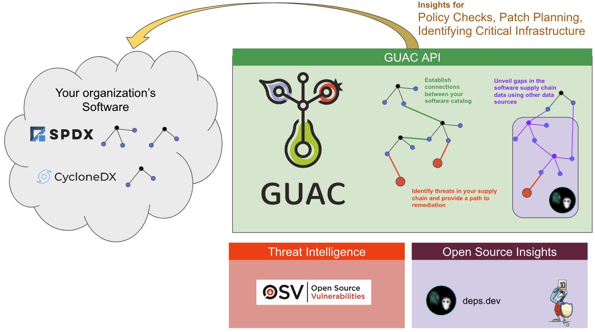
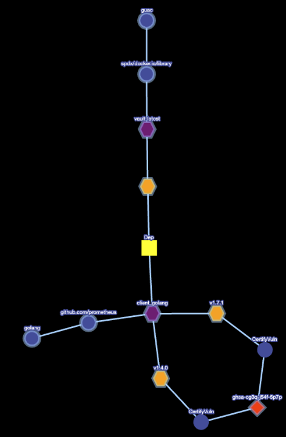

# Expanding your view of the software supply chain

**Bruce Wayne** : You're just SBOMs.

**Henri Ducard (Ra's al Ghul)** : No, no, no. An SBOM is just a document lost in
the scramble for its own importance. It can be misplaced or underutilized. But
if you make the SBOM more than just a document, you devote the SBOM to be
utilized properly to secure your software supply chain, and if the attackers
cannot get to you via supply chain attacks, then the SBOM becomes something else
entirely.

**Bruce Wayne** : Which is?

**Henri Ducard (Ra's al Ghul)** : Legend, Mr. Wayne!

Ra’s al Ghul understands that an SBOM alone can be forgotten but if you combine
it with GUAC, you can start to get a greater understanding of your own software
supply chain environment.

In this demo, we will go through the process of ingesting an SBOM and letting
GUAC expand our horizons on what we know about our environment autonomously!



We will demonstrate the various integrations of GUAC and how they work together
within the ingested SBOM.

## Requirements

- [Go](https://go.dev/doc/install)
- A fresh copy of the [GUAC service infrastructure through Docker
  Compose]({{ site.baseurl }})

## Step 1. Clone GUAC

1. Clone GUAC to a local directory:

   ```bash
   git clone https://github.com/guacsec/guac.git
   ```

2. Clone GUAC data (this is used as test data for this demo):

   ```bash
   git clone https://github.com/guacsec/guac-data.git
   ```

The rest of the demo will assume you are in the GUAC directory

```bash
cd guac
```

## Step 2: Build the GUAC binaries

Build the GUAC binaries using the `make` command:

```bash
make
```

## Step 3: Ingest Vault’s SBOM

For demo purposes, let's ingest Vault’s SBOM. To do this, we will use the help
of the `guaccollect` file command.

1. Run the following command:

   ```bash
   ./bin/guaccollect files ../guac-data/top-dh-sboms/vault.json
   ```

2. Run File collector:

   ```bash
   {"level":"info","ts":1681994359.2474601,"caller":"cmd/files.go:112","msg":"collector ended gracefully"}
   ```

## Step 4: Check the ingestion logs

We can pull the logs from docker to see the progress of the ingestion:

```bash
docker logs guac-guac-ingestor-1
```

The results for the Vault SBOM ingestion will look like the following:

```bash
{"level":"info","ts":1681992933.3817039,"caller":"emitter/nats_emitter.go:121","msg":"creating stream \"DOCUMENTS\" and subjects \"DOCUMENTS.*\""}
{"level":"info","ts":1681994359.306624,"caller":"process/process.go:97","msg":"[processor: 856ef1f5-1627-4ec9-b9e1-507b7bdee58f] docTree Processed: {Collector:FileCollector Source:file:///../guac-data/top-dh-sboms/vault.json}"}
{"level":"info","ts":1681994359.31475,"caller":"parser/parser.go:128","msg":"parsing document tree with root type: SPDX"}
{"level":"info","ts":1681994359.3263202,"caller":"helpers/assembler.go:34","msg":"assembling CertifyScorecard: 0"}
{"level":"info","ts":1681994359.32635,"caller":"helpers/assembler.go:39","msg":"assembling IsDependency: 2260"}
{"level":"info","ts":1681994359.7843368,"caller":"helpers/assembler.go:44","msg":"assembling IsOccurence: 963"}
{"level":"info","ts":1681994359.954613,"caller":"helpers/assembler.go:49","msg":"assembling HasSLSA: 0"}
{"level":"info","ts":1681994359.954643,"caller":"helpers/assembler.go:54","msg":"assembling CertifyVuln: 0"}
{"level":"info","ts":1681994359.954647,"caller":"helpers/assembler.go:59","msg":"assembling IsVuln: 0"}
{"level":"info","ts":1681994359.954649,"caller":"helpers/assembler.go:64","msg":"assembling HasSourceAt: 0"}
{"level":"info","ts":1681994359.9546518,"caller":"helpers/assembler.go:69","msg":"assembling CertifyBad: 0"}
{"level":"info","ts":1681994359.954654,"caller":"helpers/assembler.go:74","msg":"assembling CertifyGood: 0"}
{"level":"info","ts":1681994359.9546711,"caller":"cmd/ingest.go:118","msg":"got collect entries to add: 349"}
{"level":"info","ts":1681994359.9560268,"caller":"parser/parser.go:110","msg":"[ingestor: 04462d2a-a2c7-4aa9-95eb-2183cb5f249d] ingested docTree: {Collector:FileCollector Source:file:///../guac-data/top-dh-sboms/vault.json}"}
```

## Step 5: Review the automated query for more information

As the ingestion process occurs, the collector subscriber service of GUAC
collects purls, OCI strings, and others to determine if there is more
information available to be pulled into the graph DB.

As the SBOM is ingested it:

- Collects the PURLs of its dependency packages
- Queries the deps.dev database automatically to grab the source, OpenSSF
  scorecard, and its dependency information
- Links this information back to the original top-level artifact of the SBOM

This process is recursive, meaning that the PURLs that the dependency relies on
will also be queried!

We can pull the logs from docker to see which packages deps.dev collector found:

```bash
docker logs guac-depsdev-collector-1
```

The results from the deps.dev collector logs will look like the following:

```bash
{"level":"info","ts":1681994369.748968,"caller":"deps_dev/deps_dev.go:217","msg":"obtained additional metadata for package: pkg:golang/cloud.google.com/go@v0.65.0"}
{"level":"info","ts":1681994372.493675,"caller":"deps_dev/deps_dev.go:217","msg":"obtained additional metadata for package: pkg:golang/cloud.google.com/go/spanner@v1.5.1"}
{"level":"info","ts":1681994375.3482509,"caller":"deps_dev/deps_dev.go:217","msg":"obtained additional metadata for package: pkg:golang/cloud.google.com/go/storage@v1.10.0"}
{"level":"info","ts":1681994376.722956,"caller":"deps_dev/deps_dev.go:217","msg":"obtained additional metadata for package: pkg:golang/code.cloudfoundry.org/gofileutils@v0.0.0-20170111115228-4d0c80011a0f"}
{"level":"info","ts":1681994377.476279,"caller":"deps_dev/deps_dev.go:217","msg":"obtained additional metadata for package: pkg:golang/github.com/Azure/azure-pipeline-go@v0.2.3"}
{"level":"info","ts":1681994380.7538428,"caller":"deps_dev/deps_dev.go:217","msg":"obtained additional metadata for package: pkg:golang/github.com/Azure/azure-sdk-for-go@v61.4.0+incompatible"}
{"level":"info","ts":1681994382.8232992,"caller":"deps_dev/deps_dev.go:217","msg":"obtained additional metadata for package: pkg:golang/github.com/Azure/azure-storage-blob-go@v0.14.0"}
```

If we go back to the ingestor logs, we will see deps.dev documents being
ingested.

```bash
docker logs guac-guac-ingestor-1
```

These logs will show the following with the collector and source being from
deps.dev.

```bash
{"level":"info","ts":1681994398.146413,"caller":"parser/parser.go:128","msg":"parsing document tree with root type: DEPS_DEV"}
{"level":"info","ts":1681994398.146731,"caller":"helpers/assembler.go:34","msg":"assembling CertifyScorecard: 1"}
{"level":"info","ts":1681994398.148156,"caller":"helpers/assembler.go:39","msg":"assembling IsDependency: 12"}
{"level":"info","ts":1681994398.156023,"caller":"helpers/assembler.go:44","msg":"assembling IsOccurence: 0"}
{"level":"info","ts":1681994398.156051,"caller":"helpers/assembler.go:49","msg":"assembling HasSLSA: 0"}
{"level":"info","ts":1681994398.1560571,"caller":"helpers/assembler.go:54","msg":"assembling CertifyVuln: 0"}
{"level":"info","ts":1681994398.156063,"caller":"helpers/assembler.go:59","msg":"assembling IsVuln: 0"}
{"level":"info","ts":1681994398.156069,"caller":"helpers/assembler.go:64","msg":"assembling HasSourceAt: 4"}
{"level":"info","ts":1681994398.157971,"caller":"helpers/assembler.go:69","msg":"assembling CertifyBad: 0"}
{"level":"info","ts":1681994398.1579862,"caller":"helpers/assembler.go:74","msg":"assembling CertifyGood: 0"}
{"level":"info","ts":1681994398.157998,"caller":"cmd/ingest.go:118","msg":"got collect entries to add: 12"}
{"level":"info","ts":1681994398.158665,"caller":"parser/parser.go:110","msg":"[ingestor: 04462d2a-a2c7-4aa9-95eb-2183cb5f249d] ingested docTree: {Collector:deps.dev Source:deps.dev}"}
```

From the logs we see that `CertifyScorecard`, `IsDependency` and `HasSourceAt`
are being ingested. We will further inspect this information in the coming
sections.

## Step 6: Review the automated query for vulnerabilities

As we saw in the section above, GUAC automatically looks for more information
for an ingested SBOM. What about vulnerabilities?

The certifier (currently utilizing the OSV database, with more integrations to
come) is configured to run and query the vulnerability database to determine if
a package has a vulnerability.

We can pull the logs from docker to see the OSV certifier in action.

```bash
docker logs guac-osv-certifier-1
```

The results from the osv certifier logs will look like the following:

```bash
{"level":"info","ts":1681994498.498469,"caller":"cmd/osv.go:115","msg":"[209.458µs] completed doc {Collector:guac Source:guac}"}
{"level":"info","ts":1681994498.4986901,"caller":"cmd/osv.go:115","msg":"[216µs] completed doc {Collector:guac Source:guac}"}
{"level":"info","ts":1681994498.4989061,"caller":"cmd/osv.go:115","msg":"[211.042µs] completed doc {Collector:guac Source:guac}"}
{"level":"info","ts":1681994498.498911,"caller":"cmd/osv.go:122","msg":"certifier ended gracefully"}
```

We will further inspect these vulnerabilities in the following section.

## Step 7: Examine the information collected

To understand what was collected, we will utilize the graphQL playground. The
playground is accessible via: `http://localhost:8080/graphql`

From graphQL Playground, we can use the provided
[graphQL queries](https://github.com/guacsec/guac/blob/main/demo/workflow/queries.gql)
and paste them into the left column that defines the queries.

### IsDepdendency

First, we will run the `IsDepdendency` query by clicking the red play button and
selecting the `IsDepdendency`.

The query:

```bash
IsDependency(
    isDependencySpec: {dependentPackage: {namespace: "github.com/prometheus", name: "client_golang"}}
  )
```

The query will search all the `IsDepdendency` nodes and find the one that
depends on the following package:
`pkg:golang/github.com/prometheus/client_golang`

This will output the following:

```bash
{
  "data": {
    "IsDependency": [
      {
        "id": "399",
        "justification": "top-level package GUAC heuristic connecting to each file/package",
        "package": {
          "id": "2",
          "type": "guac",
          "namespaces": [
            {
              "id": "3",
              "namespace": "spdx/docker.io/library",
              "names": [
                {
                  "id": "4",
                  "name": "vault-latest",
                  "versions": [
                    {
                      "id": "5",
                      "version": "",
                      "qualifiers": [],
                      "subpath": ""
                    }
                  ]
                }
              ]
            }
          ]
        },
        "dependentPackage": {
          "id": "6",
          "type": "golang",
          "namespaces": [
            {
              "id": "396",
              "namespace": "github.com/prometheus",
              "names": [
                {
                  "id": "397",
                  "name": "client_golang",
                  "versions": []
                }
              ]
            }
          ]
        },
        "versionRange": "v1.11.1",
        "origin": "file:///../guac-data/top-dh-sboms/vault.json",
        "collector": "FileCollector"
      },
      {
        "id": "7624",
        "justification": "dependency data collected via deps.dev",
        "package": {
          "id": "6",
          "type": "golang",
          "namespaces": [
            {
              "id": "279",
              "namespace": "github.com/armon",
              "names": [
                {
                  "id": "280",
                  "name": "go-metrics",
                  "versions": [
                    {
                      "id": "281",
                      "version": "v0.3.10",
                      "qualifiers": [],
                      "subpath": ""
                    }
                  ]
                }
              ]
            }
          ]
        },
        "dependentPackage": {
          "id": "6",
          "type": "golang",
          "namespaces": [
            {
              "id": "396",
              "namespace": "github.com/prometheus",
              "names": [
                {
                  "id": "397",
                  "name": "client_golang",
                  "versions": []
                }
              ]
            }
          ]
        },
        "versionRange": "v1.4.0",
        "origin": "deps.dev",
        "collector": "deps.dev"
      },
      {
        "id": "8508",
        "justification": "dependency data collected via deps.dev",
        "package": {
          "id": "6",
          "type": "golang",
          "namespaces": [
            {
              "id": "503",
              "namespace": "github.com/docker",
              "names": [
                {
                  "id": "504",
                  "name": "docker",
                  "versions": [
                    {
                      "id": "505",
                      "version": "v20.10.10+incompatible",
                      "qualifiers": [],
                      "subpath": ""
                    }
                  ]
                }
              ]
            }
          ]
        },
        "dependentPackage": {
          "id": "6",
          "type": "golang",
          "namespaces": [
            {
              "id": "396",
              "namespace": "github.com/prometheus",
              "names": [
                {
                  "id": "397",
                  "name": "client_golang",
                  "versions": []
                }
              ]
            }
          ]
        },
        "versionRange": "v1.15.0",
        "origin": "deps.dev",
        "collector": "deps.dev"
      }
    ]
  }
}
```

From the output, we can see that prometheus/client_golang is used by a bunch of
packages. The first one shows the origin as the document that we ingested at the
beginning (related to vault). The other entries all come from deps.dev that show
that other packages `github.com/armon/go-metrics` also depend on
`prometheus/client_golang`. Meaning that `prometheus/client_golang` is both a
direct and transitive dependency for the Vault image SBOM we ingested!

### HasSourceAt

Next we will run the `HasSourceAt` query by clicking the red play button and
selecting the `HasSourceAt`.

The query:

```bash
  HasSourceAt(
    hasSourceAtSpec: {package: {namespace: "cloud.google.com", name: "go"}}
  )
```

The query will search all the `HasSourceAt` nodes and find the one related to
the package specified above.

This will output the following:

```bash
    "HasSourceAt": [
      {
        "id": "7046",
        "justification": "collected via deps.dev",
        "knownSince": "2023-04-20T12:39:26.823782Z",
        "package": {
          "id": "6",
          "type": "golang",
          "namespaces": [
            {
              "id": "1075",
              "namespace": "cloud.google.com",
              "names": [
                {
                  "id": "1076",
                  "name": "go",
                  "versions": []
                }
              ]
            }
          ]
        },
        "source": {
          "id": "6964",
          "type": "git",
          "namespaces": [
            {
              "id": "6965",
              "namespace": "github.com/googleapis",
              "names": [
                {
                  "id": "6966",
                  "name": "google-cloud-go",
                  "tag": "",
                  "commit": ""
                }
              ]
            }
          ]
        },
        "origin": "deps.dev",
        "collector": "deps.dev"
      },
```

The collector subscriber and deps.dev collector captured that the
`pkg:golang/cloud.google.com/go` has a source repo at
`github.com/googleapis/google-cloud-go`. This information shows the origin being
deps.dev.

### OpenSSF Scorecard

Next, we will run the `Scorecard` query by clicking the red play button and
selecting the `Scorecard`.

The query:

```bash
scorecards(
    scorecardSpec: {source: {namespace: "github.com/googleapis", name: "google-cloud-go"}}
  )
```

The query will search all the `scorecard` nodes and find the one related to the
source specified above.

This will output the following:

```bash
"scorecards": [
      {
        "id": "6967",
        "source": {
          "id": "6964",
          "type": "git",
          "namespaces": [
            {
              "id": "6965",
              "namespace": "github.com/googleapis",
              "names": [
                {
                  "id": "6966",
                  "name": "google-cloud-go",
                  "tag": "",
                  "commit": ""
                }
              ]
            }
          ]
        },
        "scorecard": {
          "timeScanned": "2023-04-10T00:00:00Z",
          "aggregateScore": 8.300000190734863,
          "checks": [
            {
              "check": "License",
              "score": 10
            },
            {
              "check": "Signed-Releases",
              "score": -1
            },
            {
              "check": "Dangerous-Workflow",
              "score": 10
            },
            {
              "check": "Token-Permissions",
              "score": 0
            },
            {
              "check": "Maintained",
              "score": 10
            },
            {
              "check": "Branch-Protection",
              "score": -1
            },
            {
              "check": "Packaging",
              "score": -1
            },
            {
              "check": "Security-Policy",
              "score": 10
            },
            {
              "check": "Fuzzing",
              "score": 10
            },
            {
              "check": "Binary-Artifacts",
              "score": 10
            },
            {
              "check": "Pinned-Dependencies",
              "score": 7
            },
            {
              "check": "Vulnerabilities",
              "score": 10
            },
            {
              "check": "CII-Best-Practices",
              "score": 0
            }
          ],
          "scorecardVersion": "v4.10.5-30-gfade79b",
          "scorecardCommit": "fade79ba6b60232f6ac38070f9f4a388f7580d90",
          "origin": "deps.dev",
          "collector": "deps.dev"
        }
      },
```

The above source repo we found at `github.com/googleapis/google-cloud-go` now
has the following scorecard attached to it with a timestamp on when the OpenSSF
scorecard was taken. Once again we see that we collected this information
automatically from deps.dev!

### Certify Vulnerability

Finally we will run the `CertifyVuln` query by clicking the red play button and
selecting the `CertifyVuln`.

The query:

```bash
  CertifyVuln(
    certifyVulnSpec: {vulnerability: {osv: {osvId: "ghsa-cg3q-j54f-5p7p"}}}
  )
```

The query will search all the `CertifyVuln` nodes and find the one that relates
to the OSV ID specified above.

This will output the following:

```bash
{
  "data": {
    "CertifyVuln": [
      {
        "id": "9699",
        "package": {
          "id": "6",
          "type": "golang",
          "namespaces": [
            {
              "id": "191",
              "namespace": "github.com/prometheus",
              "names": [
                {
                  "id": "192",
                  "name": "client_golang",
                  "versions": [
                    {
                      "id": "7623",
                      "version": "v1.4.0",
                      "qualifiers": [],
                      "subpath": ""
                    }
                  ]
                }
              ]
            }
          ]
        },
        "vulnerability": {
          "__typename": "OSV",
          "id": "9698",
          "osvId": "ghsa-cg3q-j54f-5p7p"
        },
        "metadata": {
          "dbUri": "",
          "dbVersion": "",
          "scannerUri": "osv.dev",
          "scannerVersion": "0.0.14",
          "timeScanned": "2023-04-20T12:41:38.272364Z",
          "origin": "guac",
          "collector": "guac"
        }
      },
      {
        "id": "14527",
        "package": {
          "id": "6",
          "type": "golang",
          "namespaces": [
            {
              "id": "191",
              "namespace": "github.com/prometheus",
              "names": [
                {
                  "id": "192",
                  "name": "client_golang",
                  "versions": [
                    {
                      "id": "14106",
                      "version": "v1.7.1",
                      "qualifiers": [],
                      "subpath": ""
                    }
                  ]
                }
              ]
            }
          ]
        },
        "vulnerability": {
          "__typename": "OSV",
          "id": "9698",
          "osvId": "ghsa-cg3q-j54f-5p7p"
        },
        "metadata": {
          "dbUri": "",
          "dbVersion": "",
          "scannerUri": "osv.dev",
          "scannerVersion": "0.0.14",
          "timeScanned": "2023-04-20T12:46:46.985135Z",
          "origin": "guac",
          "collector": "guac"
        }
      }
    ]
  }
}

```

This information came from the OSV certifier service that is constantly running
within GUAC. From this, we can see that two versions of
`github.com/prometheus/client_golang` contain the same `ghsa-cg3q-j54f-5p7p`. In
the [vulnerability CLI demo]({{ site.baseurl }}), we can use this information to determine if there is a path
between this and the version of Vault we are using. Here is a quick look at what
the visualization would look like for that:



## Expanding your view of the software supply chain

Through this demo, we learned that GUAC services are designed to extract as much
information as possible about an SBOM that it ingests. Utilizing this
information, we can quickly make up-to-date policy decisions. We can even
integrate GUAC services into an IDE to provide information on whether or not a
package should be used due to a low OpenSSF scorecard score or critical
vulnerability.

## Cleanup

To delete all the GUAC resources, run:

```bash
docker-compose down
```
