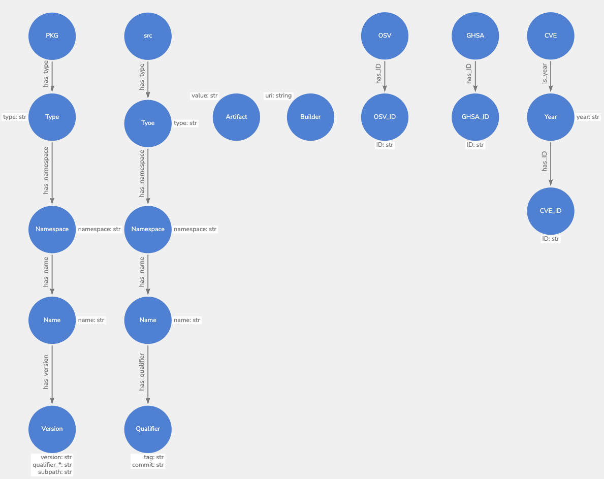
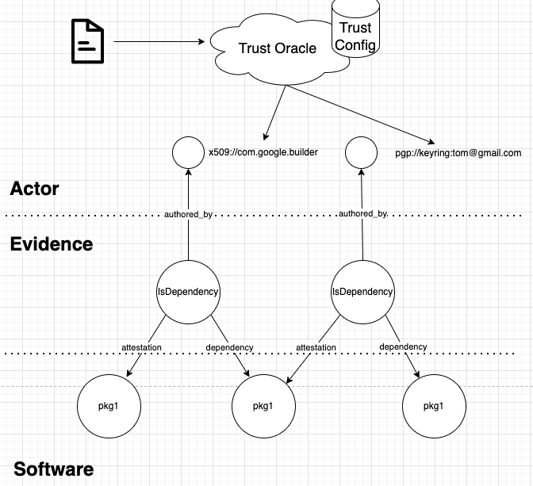

# GUAC Ontology Definitions

This document provides some insights into how the GUAC ontology was defined.

For a comprehensive and up-to-date listing of the GUAC ontology, please refer to
the [GraphQL documentation]({{ site.baseurl }}).

## Overview

The [GUAC Onlotogy]({{ site.baseurl }}) document
defines the 3 structures as the software tree, evidence tree, and actor tree.

- **Software Tree:** A factual structure that describes software entities. They
  communicate both physical (e.g. artifact and hashes) and logical (e.g. PURL)
  views, and are an extension of the idea of factual software identifiers nodes
  as described in
  [GUAC Identity Problem Design Doc](https://docs.google.com/document/d/1BUEi7q2i-KXlAhsh1adYvL1fkWN-q8FrgLyEre7c5kg/edit?resourcekey=0-02sC5-9IbTfwJckze_CDQw)(Issue
  [#217](https://github.com/guacsec/guac/issues/217)).
- **Evidence Tree:** A structure to communicate claims about nodes in a software
  tree and tie them to the actor tree. All claims are considered skeptical and
  need to be evaluated based on observing their evidence (through linking with
  the actor tree).
- **Actor Tree:** A structure to model trust and trust relationships.

## GUAC software tree

We first have to define the software tree and components. This can be broken
into: PURL, source, artifact, builder, OSV, GHSA, and CVE.

For a comprehensive and up-to-date listing of the GUAC ontology, please refer to
the [GraphQL documentation]({{ site.baseurl }}).

### Package (Pkg)

This is based on the [purl-spec](https://github.com/package-url/purl-spec) and
defined as: **scheme:type/namespace/name@version?qualifiers#subpath**. The
definition for each component is:

- **Scheme** (Required): The URL scheme with the constant value of "pkg". One of
  the primary reasons for this single scheme is to  
  facilitate the future official registration of the "pkg" scheme for package
  URLs.
- **Type** (Required): The package "type" or package "protocol" such as maven,
  npm, nuget, gem, pypi, etc.
- **Namespace** (Optional): Type-specific, name prefix such as a Maven groupid,
  a Docker image owner, a GitHub user, or an organization.
- **Name** (Required): Name of the package.
- **Version** (Optional): Version of the package.
- **Qualifiers** (Optional): Type-specific, extra qualifying data for a package
  such as an OS, architecture, a distro, etc.
- **Subpath** (Optional): Extra subpath within a package, relative to the
  package root.

It was decided that mapping to hashes as leaf nodes should not be part of the
software tree and should be linked via an attestation/evidence tree. This is due
to the fact that saying a package has an occurrence of an artifact with hash is
an opinion, and software trees need to remain factual. For example, an SBOM may
contain an entry that says "pkg://abc" has hash "sha256:def", however, this may
be incorrect - and thus GUAC providing the ability to raise counterfactuals
becomes important _if_ there is a conflict of two trusted document metadata.

### Source

Source is used to define the location of the software artifact. Similar to the
purl spec this is defined as:

- **Type:**: Version control system type (git/svn/cvs).
- **Namespace**: Location of the repo (github/gitlab/bitbucket).
- **Name**: URL to the repo.
- **Qualifier**: Tag or commit.

### Artifact

Artifact contains the hash of the software component.

### Builder

Builder is the component that built the artifact (for example GitHub actions,
FRSCA). This contains the URI of the builder.

### [OSV](https://osv.dev/) or Open Source Vulnerability

OSVs contain the OSV ID that can be mapped to a GHSA or CVE.

### GHSA - GitHub Security Advisory

GHSA contains a GHSA ID that maps to the
[GitHub Advisory Database](https://github.com/advisories).

### CVE - Common Vulnerabilities and Exposures

CVE contains a CVE ID.

A visualization of some of the above software trees would look like:

## GUAC Evidence Tree

An evidence tree would then create attestations/actions against nodes of a
software tree and link them to each other and to nodes in the actor tree. We
note that attestations/actions represented as evidence trees can be overlaid not
only on leaf nodes. For example, an attestation may be on all software versions,
and thus may be applied upon the software tree representation of the PURL:
pkg://pypi/requests, instead of doing it on a particular version number. This
also applies to the representation of the source where the name and qualifier
(containing the tag/commit) may be used for the attestation.

An example of a predicate is:

**IsDependency:**

- **Description**: Attestation that the package has the following dependencies
  (pkg) based on a justification
- **Subject**:
  - pkg
- **Object**:
  - depends_on ( pkg ) (**pkgName**)
- **Properties**:
  - justification ( string )
  - version_range ( string )
  - source ( string )
  - collector ( string )

For a list of all predicates, please refer to the [GraphQL
documentation]({{ site.baseurl }}).

## GUAC Actor Tree (Not in v0.1 BETA)

The structure of the trust ontology is one of either delegation (e.g.
certificate authorities), or one of a web of trust (e.g. pgp). These were the
two topologies of trust that encapsulate the most common trust models.

We determined there to be 3 different dimensions of trust of action:

- **Identity**: Do I trust verification of the entity that has made this claim?
- **Capability**: Do I trust the entity to assert that claim?
- **Subject**: Do I trust that the entity is an authority to such a claim?

Then we decided to start with the following:

- **Structure:** Only interested in the leaf nodes of a trust ontology.
- **Reasoning:** We only care about the identity for the GUAC BETA, and
  capabilities as far as intrinsic protocols allow the expressiveness of (x509
  expiry and key capabilities).

The way to do this is to have identity nodes as part of the "Actor Tree" be
singletons represented by a URI with information on whether or not they've been
verified. These URIs would be validated with the root of trust via trust oracle,
which would use a trust config per GUAC instance to verify the signatures and
provide a URI that can be used to make trust decisions. This is building upon
the proposal as in the "Trust Policy" section of this document:
[GUAC Identity Problem Design Doc](https://docs.google.com/document/d/1BUEi7q2i-KXlAhsh1adYvL1fkWN-q8FrgLyEre7c5kg/edit?resourcekey=0-02sC5-9IbTfwJckze_CDQw#heading=h.h9kfextfhlqn),
and discussed as part of
[this issue](https://github.com/guacsec/guac/issues/75).

This would look like the following from a topological perspective. However,
since they are singleton nodes, they can be stored as URIs in each evidence node
and can be de-normalized if there is a need to optimize queries.

