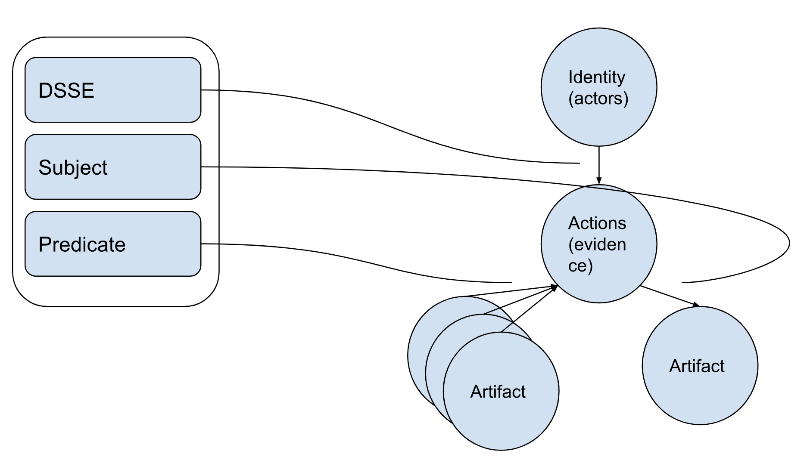
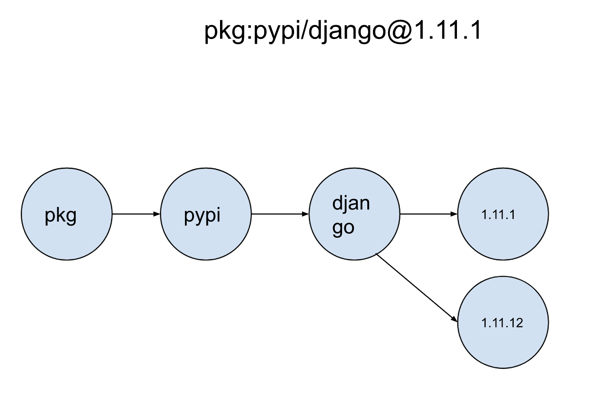
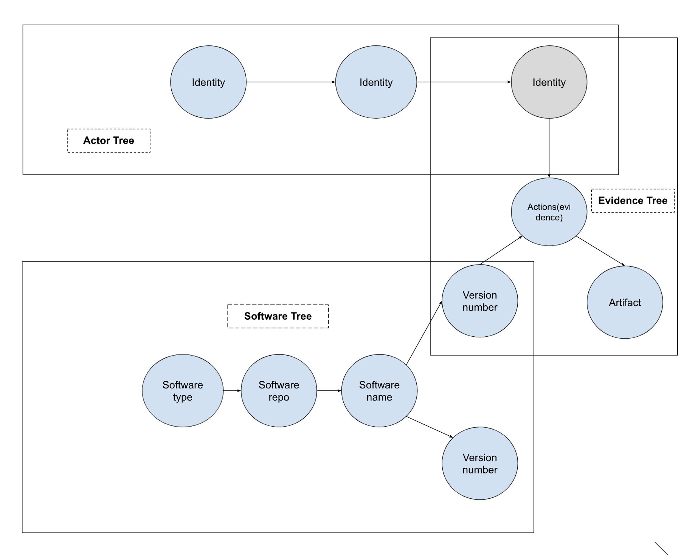
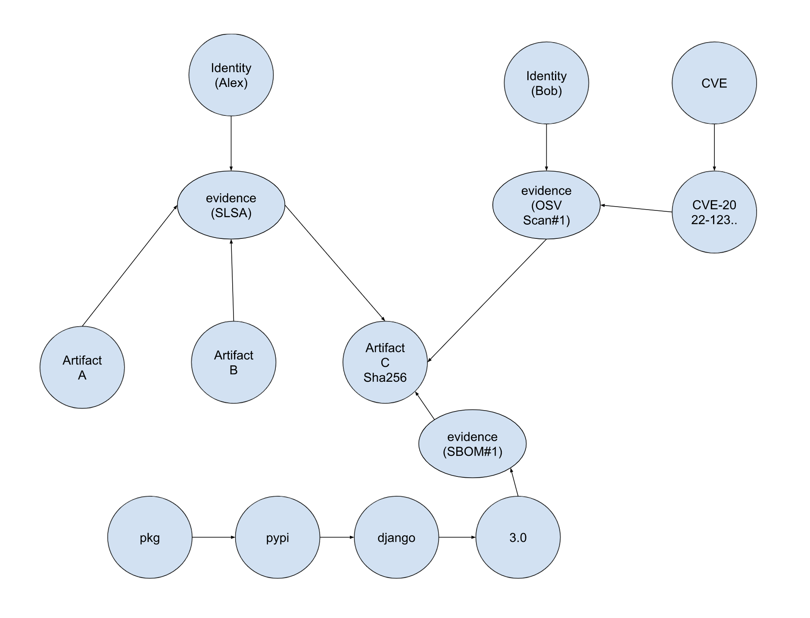
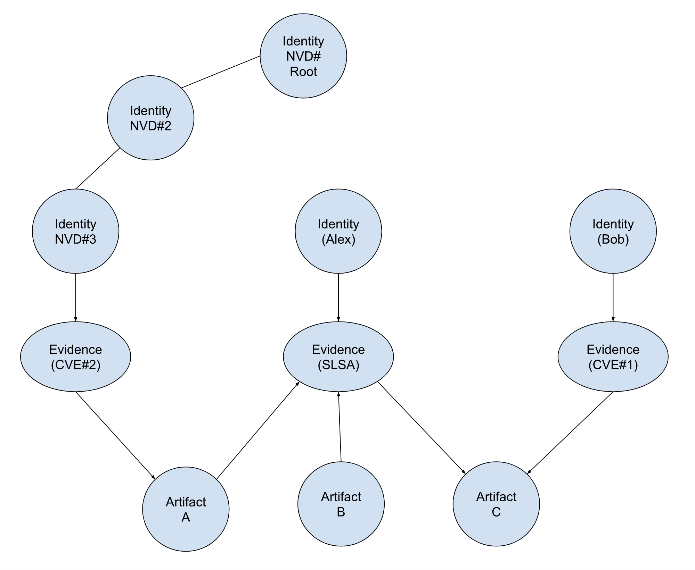
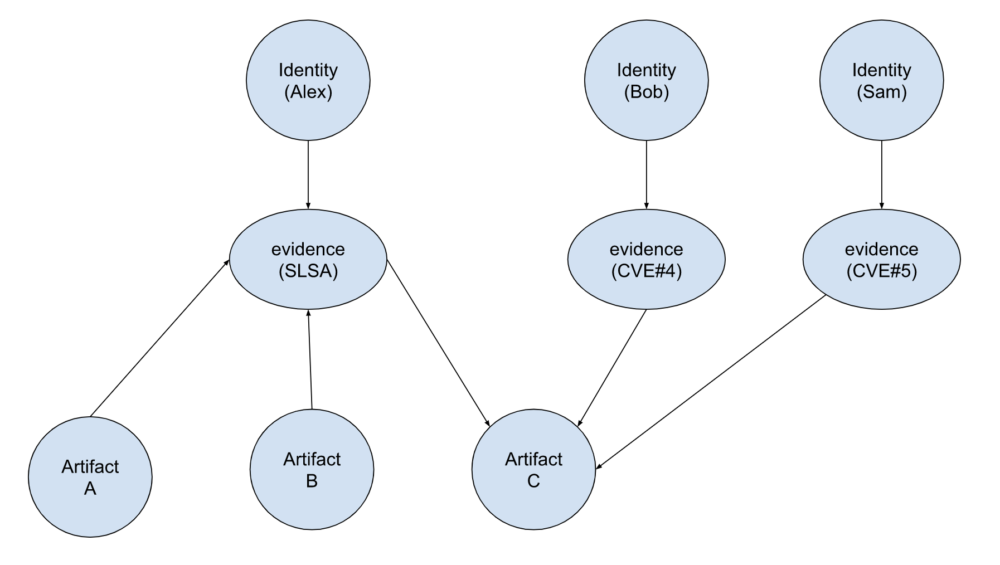
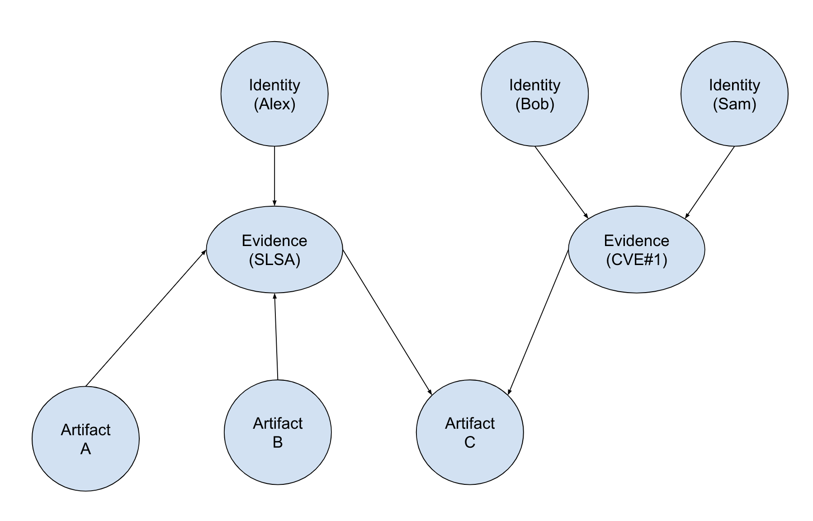

# GUAC Ontology

## The problem with software supply chains

Software supply chains are more sophisticated than ever and so are their
compromises. Because of this, various tools have spun up around software
metadata, such as SLSA/In-toto and SBOM. To better understand the security
posture of a software, we need to know the software supply chain properties of
each used artifact. To solve this problem, we built a software supply chain
knowledge graph, GUAC (Graph for Understanding Artifact Composition). GUAC
allows us to efficiently query information about software supply chain
properties and efficiently update the state of the supply chain.

## Distilling an ontology for GUAC

At a low level, a software supply chain is a series of _actions_ carried out by
_actors_ to produce _artifacts._ Generally speaking, determining the quality
properties of an artifact boils down to how much we trust actors, what
information can we glean from their actions, and how artifacts relate to each
other.

By building a universal graph, we are able to answer questions such as:

- Is this _artifact_ affected by this _vulnerability_ as _reported_ by this
  _scan_?
- Has this _artifact_ been _reviewed_ by a _trusted individual_?
- Was this _artifact_ _involved_ in this security _incident_?

We believe that in order to be able to answer these questions, we just need to
appropriately collect the following information:

- Evidence collection about actions
- Actors and actions
- Software and its lineage

With this, we are able to transform any informational query into one that
involves all three (artifacts, actors, actions).

## Mapping the three elements of supply chains to a universal graph

All three elements can be collected for public information and used to construct
a _semantic_ _tree_ about their respective elements. This allows us to turn the
collector functions into a _bijection_ and prevent the loss of data during the
collection process.

We develop these bijections in the collector to build trees of evidence, trees
of actions, and trees of software lineage that we can then connect to each other
to build the graph.

### The evidence tree

The first tree of information is the evidence tree. For each piece of evidence
collected we are able to build a tree of the following elements by following the
**ITE-6 processing model**:

- **DSSE layer:** Creates an edge between an actor (identity) and an action
- **Subject layer:** Creates an edge between an action and a software instance
  (e.g., identified by a purl and a hash)
- **Predicate layer:** Creates an edge between a collection of software
  instances and an action (e.g., a series of packages and environmental tools)

These trees can be broken down to further separate actions and evidence. For
example, an SBOM using SPDX can be broken down into a series of evidentiary
information that separates each relationship information with a separate one.

### The actor tree

The actor tree attempts to model the trust relationships between actors, as well
as the provenance information between actors and claims. At an ideal level, this
portion of the graph allows us to model such trust relationships between actors
as a separate operation. While there are many standards for trust models (e.g.,
PKIx and PGP), the fundamental property of trust is that it can be either
provided de-facto (i.e., by a policy mechanism) or it can be compounded (i.e.,
it can be computed as a function of a collection of the former type).

For example, an X509 certificate allows us to build an identity tree of the
following nature:

- A certificate represents an identity
- A certificate chain represents a path of trust between a series of identities

This tree can be collected from public identity sources (e.g., a certificate
transparency log, or a pgp keyserver) and used to create a collection of trust
trees.

### The software tree

Finally, the software tree represents a series of software properties that
relate to their logical collection up to their "physical instantiations". This
can be easily modeled using a pURL semantic, which describes a software
artifact. Take for example the following purl: pkg:pypi/django@1.11.1. It can be
used to model software relationships with the following properties:

- A software type (pkg)
- A software repository (pypi)
- A software name (django)
- A version (1.11.1)

### Combining trees for more expressive search queries

The three trees combine as following:

- The hash in the software tree is the artifact in the evidence tree
- The identity in the evidence tree is the signature in the actor tree

With this in mind, GUAC queries can be defined as:

- Network structure tests (e.g., reachability)
- Node property and test

## Use cases

### Identifying connected components

Given a starting node, retrieve the entire connected component of it.

**Example diagram**

An organization wants to dump all the metadata and assertions related to an
artifact.

**_Query_:** Connected component given start node artifact C  
**_Approach_:** Starting from artifact C, get all first neighbor evidence nodes,
then get the connected component of each evidence. The result subgraph is the
connected component starting artifact C  
**_Result_:**

### Reachability

An organization wants to check if its software is affected by a recently
published vulnerability with an assigned CVE number, signed by a specific
vulnerability database.

- Query the GUAC Graph such that based on the artifact nodes of the software,
  can you reach the CVE evidence, then the vulnerability database? If yes, then
  the software is vulnerable to it.

**Example diagram**

**_Query_:** Is artifact C affected by CVE#2, and has that report been done by
the national vulnerability database?  
**_Approach_:** From Identity tree, determine which nodes belong to that class
of identities. Is there a path from the artifact -> CVE -> any node in the class
of identities? **_Result_:** From identity tree, NVD identities are NVD#Root,
NVD#2,NVD#3.  
Walk the path (artifact C -> SLSA evidence -> Artifact A -> CVE#2 evidence->
identity NVD#3)

This does not cover a case in which two different reports describe the same
artifact and do **not** agree on the security posture of an artifact.

### Counterfactual (not part of the v0.1 BETA)

An organization wants to check the vulnerabilities that affect its software.

- Query the GUAC Graph such that based on the artifact nodes of the software, do
  they have any neighbor CVE evidence?

**Example diagram**

**_Query_:** Is artifact C affected by any vulnerability?  
**_Approach_:** Using first neighbor search, is there any neighbor CVE evidence
for artifact C?  
**_Result_:** Using first neighbor search, Bob signed CVE#4 evidence, while Sam
signed CVE#5 evidence. This is conflicting information. Bob and Sam disagree
about the CVEs affecting artifact C.

Conflicting information should be flagged as something to be analyzed further.

## Hypergraph semantics (not part of v0.1 BETA)

A hypergraph is a graph in which hyperedges can connect to a subset of nodes
rather than two nodes. Hyperedges can be used to make logical groupings for
nodes that represent the same thing, and they may appear in GUAC in couple of
ways:

- **Artifacts:** Identical artifacts or packages. For example, an SLSA document
  describing an artifact with multiple hashes makes the implicit claim that
  these hashes describe the same content. These hashes of the same artifact
  could be grouped together in a hypergraph.
- **Identities:** The same identity has multiple public keys, or multiple people
  represents an identity.

**Agreement over same CVE evidence**

