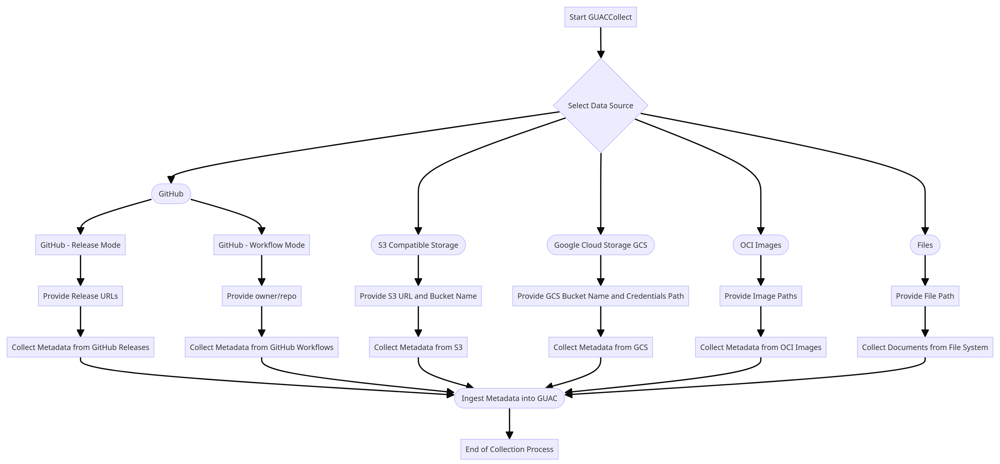

# guaccollect

`guaccollect` is a command-line tool in the GUAC ecosystem designed for
collecting and ingesting software bills of materials (SBOMs), attestations, and
other metadata documents from various sources. This tool supports a wide range
of data sources, including GitHub, S3, Google Cloud Storage (GCS), and OCI
images.

## Use Cases

`guaccollect` enables you to:

- **Collect Metadata from GitHub**: Fetch metadata documents from GitHub
  releases or workflows.
- **Ingest from Cloud Storage**: Support for S3, GCS, and other cloud storage
  solutions to ingest SBOMs and attestations.
- **Download from OCI Images**: Retrieve SBOMs and attestations embedded in OCI
  images.
- **File System Collection**: Collect documents directly from a specified file
  path on your system.

## Usage

### Commands

`guaccollect` supports the following commands:

| Command    | Description                                                                            |
| ---------- | -------------------------------------------------------------------------------------- |
| cd         | Runs the [Clearly Defined certifier]({{ site.baseurl }}) |
| completion | Generate the autocompletion script for the specified shell                             |
| deps_dev   | Queries pURLS against deps.dev to find additional metadata to add to GUAC graph        |
| files      | Ingest a folder of files                                                               |
| gcs        | Ingest SBOMs and attestations from a Google Cloud Storage bucket                       |
| github     | Download metadata documents stored in GithHub releases                                 |
| help       | Help about any command                                                                 |
| image      | Ingests SBOMs and attestations stored in an OCI image                                  |
| osv        | Runs the [OSV certifier]({{ site.baseurl }})            |
| registry   | Ingests SBOMs and attestations store in an OCI registry                                |
| s3         | Ingests SBOMs and attestations from S3 compatible bucket                               |
| scorecard  | Runs the OpenSSF Scorecard certifier                                                   |

### Flags

`guaccollect` accepts the following flags. Subcommands have have additional
flags.

| Flag                     | Description                                                                            | Default                                 |
| ------------------------ | -------------------------------------------------------------------------------------- | --------------------------------------- |
| `--blob-addr string`     | [gocloud](https://gocloud.dev/howto/blob/) connection string for blob store configured | "file:///tmp/blobstore?no_tmp_dir=true" |
| `--csub-addr string`     | Address to connect to collect-sub service                                              | "localhost:2782"                        |
| `--csub-tls`             | Enable tls connection to the server                                                    |
| `--csub-tls-skip-verify` | Skip verifying server certificate (e.g. for self-signed certificates)                  |
| `--enable-prometheus`    | Enable prometheus metrics                                                              | true                                    |
| `--gql-addr string`      | GraphQL server endpoint                                                                | "http://localhost:8080/query"           |
| `-h, --help`             | Help for guaccollect                                                                   |
| `--publish-to-queue`     | Enable/disable message publish to queue                                                | true                                    |
| `--pubsub-addr string`   | [gocloud](https://gocloud.dev/howto/blob/) connection string for pubsub configured     | "nats://127.0.0.1:4222"                 |
| `--service-poll`         | Sets the collector or certifier to polling mode                                        | true                                    |
| `--use-csub`             | Use collectsub server for datasource                                                   | true                                    |
| `-v, --version`          | Version for guaccollect                                                                |

## Examples

`guaccollect` offers a modular design with separate commands for each data
source.



### GitHub

```bash
./guaccollect github --github-mode release <release_url1> <release_url2>
./guaccollect github --github-mode workflow <owner>/<repo>
```

### S3 Compatible Storage

```bash
./guaccollect s3 --s3-url <s3_url> --s3-bucket <bucket_name> --poll
```

### Google Cloud Storage (GCS)

```bash
./guaccollect gcs <bucket_name> --gcs-credentials-path /path/to/credentials.json
```

### OCI Images

```bash
./guaccollect image <image_path1> <image_path2>
```

### Files

```bash
./guaccollect files <file_path>
```
