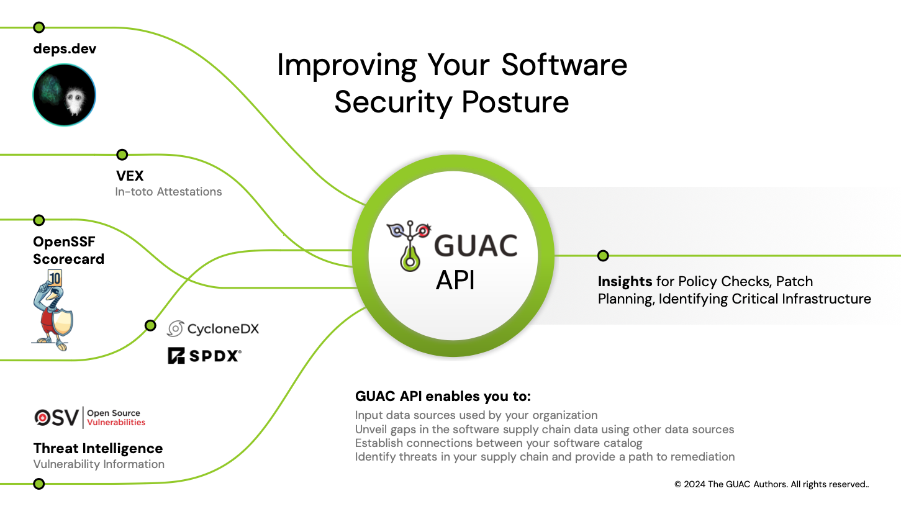

# GUAC Docs

Graph for Understanding Artifact Composition (GUAC) gives you organized and
actionable insights into your software supply chain security position. GUAC
ingests software security metadata, like SBOMs, and maps out the relationship
between software so that you can fully understand your software security
position. Using GUAC, you can drive higher-level organizational outcomes such as
audit, policy, risk management, and even developer assistance.

## Introduction video

<iframe width="560" height="315" style="max-width: 100%" src="https://www.youtube-nocookie.com/embed/U7jRTZUDHYM?si=zTeaZXIBEPd1ZV0y" title="YouTube video player" frameborder="0" allow="accelerometer; autoplay; clipboard-write; encrypted-media; gyroscope; picture-in-picture; web-share" allowfullscreen></iframe>

## What can GUAC do

### Visualize your supply chain


The [GUAC Visualizer]({{ site.baseurl }})
explores the various nodes and relationships of GUAC. A particular node can be
searched for, or you can click through each node to discover its relationships.
Most CLI commands below also provide a visualizer link to load the results of
the command into the visualizer.

### Search for vulnerabilities via transitive dependencies in the GUAC graph

The [Query Vulnerability via CLI Demo]({{ site.baseurl }}) covers the `guacone query vuln` command. Given a
Package-URL, this command searches the GUAC graph for any paths leading to any
known vulnerabilities and produces a report. Example:

```bash
+-------------+-----------+---------------------------------------+
| NODE TYPE   | NODE ID   | ADDITIONAL INFORMATION                |
+-------------+-----------+---------------------------------------+
| certifyVuln | 148776    | vulnerability ID: ghsa-599f-7c49-w659 |
| certifyVuln | 147968    | vulnerability ID: dsa-5343-1          |
| certifyVuln | 147969    | vulnerability ID: dsa-5417-1          |
| certifyVuln | 148467    | vulnerability ID: dsa-5122-1          |
| certifyVuln | 148766    | vulnerability ID: ghsa-7rjr-3q55-vv33 |
| certifyVuln | 148767    | vulnerability ID: ghsa-8489-44mv-ggj8 |
| certifyVuln | 148768    | vulnerability ID: ghsa-fxph-q3j8-mv87 |
| certifyVuln | 148769    | vulnerability ID: ghsa-jfh8-c2jp-5v3q |
| certifyVuln | 148770    | vulnerability ID: ghsa-p6xc-xr62-6r2g |
| certifyVuln | 148771    | vulnerability ID: ghsa-vwqq-5vrc-xw9h |
+-------------+-----------+---------------------------------------+
Visualizer url: http://localhost:3000/?path=20041,20040,20039,15,26177,22175,22174,20781,2455,147738,148776,26195,21827,2158,1302,1301,147731,147968,147815,147969,26202,74224,1411,147764,148467,26206,18025,18024,18023,147803,148766,147798,148767,147799,148768,147733,148769,147774,148770,147765,148771,75955,81946,87980,94043,99976,105990,1523,2110,2230,2360,2512,2744,3474,4167
```

### Generate a summary report of a given Package-URL

See the [What is Known and Unknown about your Software Supply Chain]({{
site.baseurl }}) demo for an overview of the
`guacone query known` command. This takes a Package-URL then queries GUAC for
all known information about that package. Example:

```bash
+---------------------------------------------------------------------------------+
| Package Name Nodes                                                              |
+-----------+-----------+---------------------------------------------------------+
| NODE TYPE | NODE ID   | ADDITIONAL INFORMATION                                  |
+-----------+-----------+---------------------------------------------------------+
| hasSrcAt  | 7647      | Source: git+https://github.com/prometheus/client_golang |
+-----------+-----------+---------------------------------------------------------+
Visualizer url: http://localhost:3000/?path=578,327,6,7647
+-----------------------------------------------------------------+
| Package Version Nodes                                           |
+-------------+-----------+---------------------------------------+
| NODE TYPE   | NODE ID   | ADDITIONAL INFORMATION                |
+-------------+-----------+---------------------------------------+
| certifyVuln | 13471     | vulnerability ID: ghsa-cg3q-j54f-5p7p |
| certifyVuln | 13473     | vulnerability ID: go-2022-0322        |
+-------------+-----------+---------------------------------------+
Visualizer url: http://localhost:3000/?path=7600,578,327,6,13471,13473
```

### Store SBOM data and collect additional information about the packages

In the [Expanding your view of the software supply chain]({{ site.baseurl
}}) demo, see how GUAC maps ingested SBOM
data to graph-based nodes and relationships. Explore additional information
gathered, and see how those are connected to the package nodes in the graph
schema.

- Source location from [Deps.dev](https://deps.dev/)
- [OpenSSF Scorecard](https://securityscorecards.dev/) results
- Vulnerability data from [OSV.dev](https://osv.dev/)

## How GUAC works



## Get more information on GUAC

Visit the [GUAC website](https://guac.sh/) to learn more about GUAC and join the
community!
