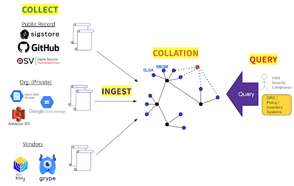

Graph for Understanding Artifact Composition (GUAC) gives you organized and actionable insights into your software supply chain security position. GUAC ingests software security metadata, like SBOMs, and maps out the relationship between software so that you can fully understand your software security position. Using GUAC, you can drive higher-level organizational outcomes such as audit, policy, risk management, and even developer assistance.

## How GUAC works

## Get more information on GUAC

Visit the [GUAC website](https://guac.sh/) to learn more about GUAC and join the community!
