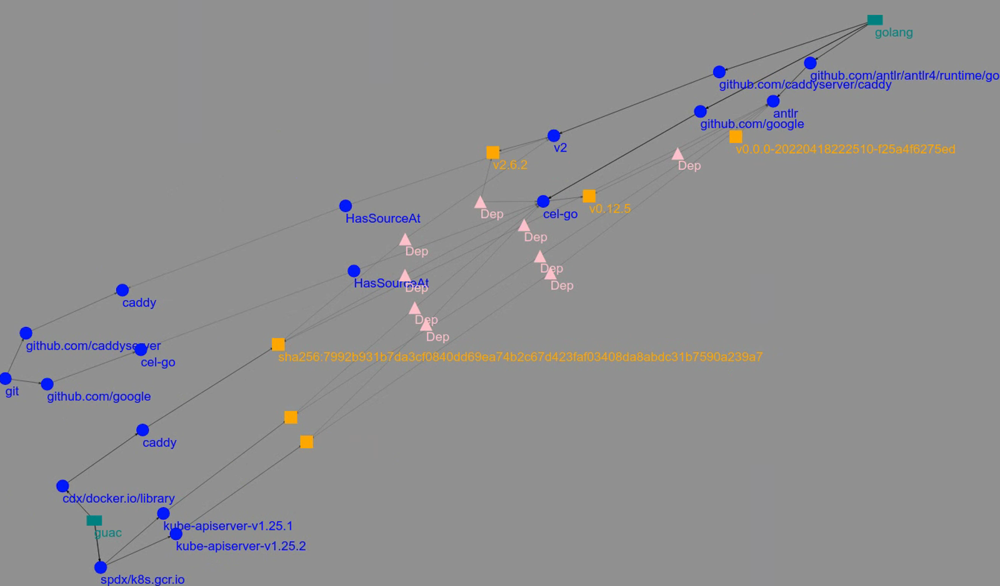
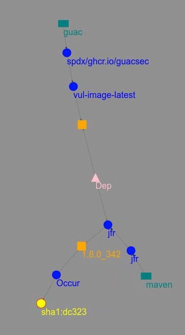

# Query for a patch plan via CLI Demo

In this demo, we will utilize a GUAC CLI that will allow us to input a
vulnerable purl (package URL) and see what else is affected by this package
being vulnerable-- meaning we are querying for the package's dependents. This
tutorial assumes you know which package has some sort of vulnerability or
malware affecting it, or which package is your concern.

We will get back a patch plan which includes a visual representation of the
blast radius, meaning a link to view the subgraph of dependent packages in the
GUAC visualizer. It will also return a list of frontiers. These frontiers
represent what can be patched to resolve the vulnerability, starting from the
lowest level possible, i.e. the package itself. If you don't have access to fix
this package directly, you could look in the next frontier and so on. It will
also list out and points of contact for a given node, if available in the graph.
This will help you know who to contact to resolve the issue. All these outputs
together can be used to help figure out the best plan of action in order to
resolve a security incident.

## Requirements

- A fresh copy of the [GUAC service infrastructure through Docker Compose]({{
  site.baseurl }}). Including the `guacone` binary in your
  path and [demo data]({{ site.baseurl}})
  extracted to `guac-data-main`.
- The [GUAC visualizer]({{ site.baseurl }}) up and
  running.

## Run the Query Patch CLI

**Packge Name Node Example**

In this demo, we will query for the patch plan of the following package (at the
name level):

```bash
pkg:golang/github.com/antlr/antlr4/runtime/go/antlr
```

The query we will run is as follows:

```bash
guacone query patch --start-purl "pkg:golang/github.com/antlr/antlr4/runtime/go/antlr" --search-depth 10
```

Note that we are using a search depth of ten because this example the whole
graph has a depth of less than ten so we will get back the entire subgraph. This
number can be lowered or raised depending on your needs.

You can also input a package name or package version node to stop at using the
--stop-purl flag.

The expected output for the example query above is as follows:

```bash
---FRONTIER LEVEL 0---
353: pkg:golang/github.com/antlr/antlr4/runtime/go/antlr
354: pkg:golang/github.com/antlr/antlr4/runtime/go/antlr@v0.0.0-20220418222510-f25a4f6275ed

---FRONTIER LEVEL 1---
193: pkg:golang/github.com/google/cel-go
194: pkg:golang/github.com/google/cel-go@v0.12.5

---FRONTIER LEVEL 2---
51113: pkg:guac/spdx/k8s.gcr.io/kube-apiserver-v1.25.2
129824: src:git/github.com/google/cel-go
51112: pkg:guac/spdx/k8s.gcr.io/kube-apiserver-v1.25.2
48784: pkg:guac/spdx/k8s.gcr.io/kube-apiserver-v1.25.1
205: pkg:golang/github.com/caddyserver/caddy/v2@v2.6.2
48785: pkg:guac/spdx/k8s.gcr.io/kube-apiserver-v1.25.1
204: pkg:golang/github.com/caddyserver/caddy/v2

---FRONTIER LEVEL 3---
129945: src:git/github.com/caddyserver/caddy
106: pkg:guac/cdx/docker.io/library/caddy@sha256:7992b931b7da3cf0840dd69ea74b2c67d423faf03408da8abdc31b7590a239a7?tag=latest
105: pkg:guac/cdx/docker.io/library/caddy

---INFO NODES---
no info nodes found

---POINTS OF CONTACT---
no POCs found


---SUBGRAPH VISUALIZER URL---
http://localhost:3000/?path=444,9,49041,36298,51225,130107,192,130308,129720,500,49018,51117,130044,203,130284,129937,465,353,354,193,194,51113,129824,51112,48784,205,48785,204,129945,106,105
```

Note that the node IDs can change.

The visualizer looks like the following (once you adjust the position of the
antlr node)



You can match up the outputs of the frontiers to the nodes in the subgraph in
order to figure a viable plan of action to remediate an issue.

**Package Version Node Example**

To input a package version instead of a package name for the purl, set the
--is-pkg-version-start or --is-pkg-version-stop flag(s) to true.

For this example, we will use the following package (at the version level):

```bash
pkg:maven/jfr/jfr@1.8.0_342
```

To find its patch plan run the following query with the --is-pkg-version-start
flag:

```bash
guacone query patch --start-purl "pkg:maven/jfr/jfr@1.8.0_342" --search-depth 10 --is-pkg-version-start true
```

The number after the @ symbol denotes the version.

The expected output for the example query above is as follows:

```bash
---FRONTIER LEVEL 0---
18572: pkg:maven/jfr/jfr@1.8.0_342
18571: pkg:maven/jfr/jfr

---FRONTIER LEVEL 1---
16669: pkg:guac/spdx/ghcr.io/guacsec/vul-image-latest
16668: pkg:guac/spdx/ghcr.io/guacsec/vul-image-latest
25104: artifact: algorithm-sha1 | digest:dc323c36dcbb81f74adabe3cc38bdb88bb5dbe66

---INFO NODES---
no info nodes found

---POINTS OF CONTACT---
no POCs found


---SUBGRAPH VISUALIZER URL---
http://localhost:3000/?path=26193,16667,36245,18570,18572,18571,16669,16668,25104
```

The visualizer looks like the following (you may neeed to move the visualizer to
over see the graph):



Notice that the output still contains the dependent package of the package name
attached to the version we inputted. This is because if a specific package
version is vulnerable, it implies that the name one level above it is affected
as well.

## Conclusion

From this demo, we learned how we can quickly analyze the GUAC data to find a
patch plan for a specific package we are interested in. The patch plan includes
the blast radius, frontiers or level of what can be patched, and points of
contact. This information can provide you with the tools needed to make a swift
and educated decision on how to best go about tackling a security incident!
