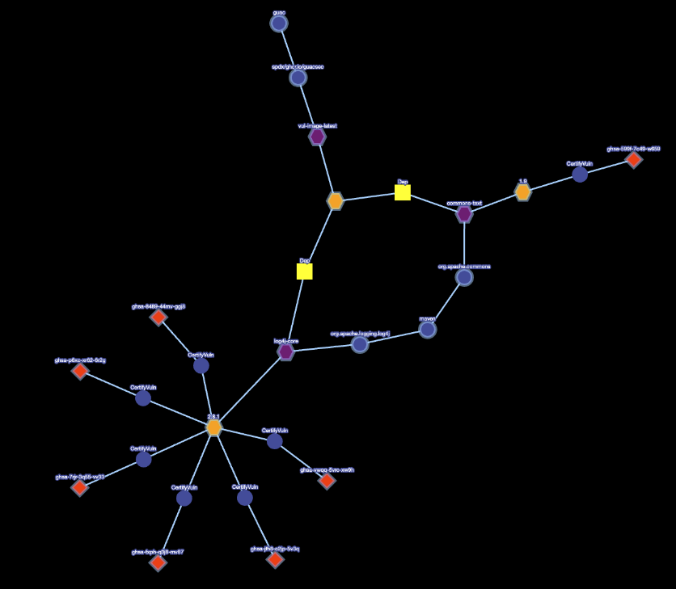
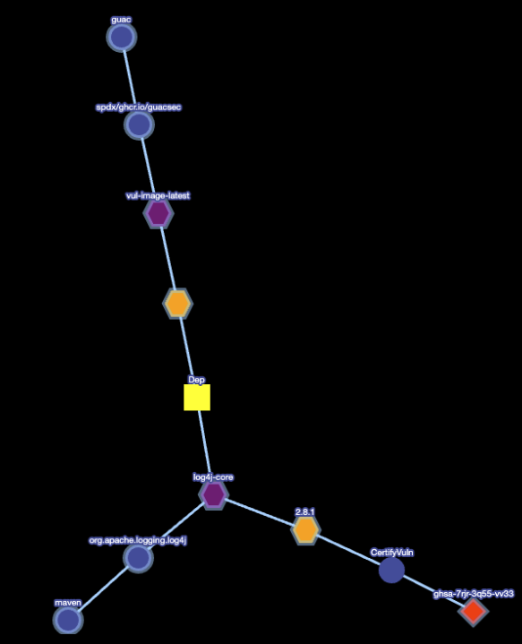

# Query Vulnerability via CLI Demo

GUAC's GraphQL API allows us to integrate the knowledge graph into various
applications. In the other examples, we saw how it can be used to visualize and
query the graph from a React UI, and even a small Python application to query
for paths between nodes.

In this demo, we will utilize a Go CLI that will allow us to query if a purl
(package URL) has any vulnerabilities based on its direct and indirect
dependencies. We will so see if a purl is affected by a specific vulnerability
and which dependencies need to be updated to remediate that particular
vulnerability.

## Requirements

- A fresh copy of the [GUAC service infrastructure through Docker Compose]({{
  site.baseurl }}). Including the `guacone` binary in your path
  and [GUAC Data](https://github.com/guacsec/guac-data/archive/refs/heads/main.zip)
  extracted to `guac-data-main`.

- The [GUAC visualizer]({{ site.baseurl }}) up and
  running.

## Step 1. Ingest a vulnerability SPDX SBOM

For demo purposes, let's ingest a known bad SPDX SBOM that contains several
vulnerabilities. To do this, we will use the `guacone` command, which is an
all-in-one utility that can take a collection of files and ingest them into the
GUAC graph.

In your terminal window, run:

```bash
guacone collect files guac-data-main/docs/spdx/spdx_vuln.json
```

This will ingest the vulnerable SPDX SBOM into GUAC so that various insights can
be easily queried.

Once ingested you will see the following message:

```bash
{"level":"info","ts":1681821120.162612,"caller":"cmd/files.go:181","msg":"[2.158961542s] completed doc {Collector:FileCollector Source:file:///guac-data-main/docs/spdx/spdx_vuln.json}"}
{"level":"info","ts":1681821120.162633,"caller":"cmd/files.go:188","msg":"collector ended gracefully"}
{"level":"info","ts":1681821120.1626382,"caller":"cmd/files.go:201","msg":"completed ingesting 1 documents of 1"}
```

## Step 2: Draw further insight from OSV.dev

One of the benefits of GUAC is that it’s not a static database; it is constantly
evolving and trying to find more information on the artifacts ingested. To
demonstrate this, we will utilize one of the components of GUAC known as a
“certifier”. The role of the certifier is to continuously run and query for
additional information from various sources (such as osv.dev and scorecard to
start with) and keep the information specified up-to-date within GUAC.

The certifier can be run in two modes:

- **Polling:** For continuous updates on the information
- **Non-polling:** Run once and collect the data

For this demo, the polling version of the OSV certifier is already running as
part of the Docker Compose.

The OSV certifier will query osv.dev and determine if the various components
that make up our images have vulnerabilities we should be worried about.

Switch back to the compose window and you will soon see that the OSV certifier
recognized the new packages and is looking up vulnerability information for
them.

Once the OSV certifier has completed running and you will see the following
message:

```bash
{"level":"info","ts":1681821205.06338,"caller":"cmd/osv.go:122","msg":"certifier ended gracefully"}
```

**If the queries return an error,** you can wait for the OSV certifier to
re-scan (this is done every 5 minutes) or force it to run manually via:

```bash
guacone certifier osv
```

In a running instance of GUAC, as you are ingesting new SBOMs and artifacts, the
certifier will automatically query OSV for the latest information and populate
GUAC. After a set period of time (set by the user), it will re-query the
information to ensure that it's always up-to-date. For demo purposes, we ran it
just once.

## Step 3: Run the Query Vulnerability CLI

Now that our GUAC instance is up and running with up-to-date information on the
vulnerable image that we ingest, we will look at how we can utilize this data
effectively.

### Query pURL to determine vulnerabilities

In this first example, we will query if our image has any vulnerabilities
(either directly or indirectly) by running:

```bash
guacone query vuln "pkg:guac/spdx/ghcr.io/guacsec/vul-image-latest"
```

**If you get this error:**

```bash
{"level":"fatal","ts":1681822176.390916,"caller":"cmd/query_vulnerability.go:179","msg":"error searching dependency packages match: error querying neighbor: error certify vulnerability node not found, incomplete data. Please ensure certifier has run"}
```

The OSV certifier may not have completed the scan for all the packages. To force
the scan to occur immediately, run:

```bash
guacone certifier osv
```

Successful output will show something similar to the following:

```bash
+-------------+-----------+---------------------------------------+
| NODE TYPE   | NODE ID   | ADDITIONAL INFORMATION                |
+-------------+-----------+---------------------------------------+
| certifyVuln | 148776    | vulnerability ID: ghsa-599f-7c49-w659 |
| certifyVuln | 147968    | vulnerability ID: dsa-5343-1          |
| certifyVuln | 147969    | vulnerability ID: dsa-5417-1          |
| certifyVuln | 148467    | vulnerability ID: dsa-5122-1          |
| certifyVuln | 148766    | vulnerability ID: ghsa-7rjr-3q55-vv33 |
| certifyVuln | 148767    | vulnerability ID: ghsa-8489-44mv-ggj8 |
| certifyVuln | 148768    | vulnerability ID: ghsa-fxph-q3j8-mv87 |
| certifyVuln | 148769    | vulnerability ID: ghsa-jfh8-c2jp-5v3q |
| certifyVuln | 148770    | vulnerability ID: ghsa-p6xc-xr62-6r2g |
| certifyVuln | 148771    | vulnerability ID: ghsa-vwqq-5vrc-xw9h |
+-------------+-----------+---------------------------------------+
Visualizer url: http://localhost:3000/?path=20041,20040,20039,15,26177,22175,22174,20781,2455,147738,148776,26195,21827,2158,1302,1301,147731,147968,147815,147969,26202,74224,1411,147764,148467,26206,18025,18024,18023,147803,148766,147798,148767,147799,148768,147733,148769,147774,148770,147765,148771,75955,81946,87980,94043,99976,105990,1523,2110,2230,2360,2512,2744,3474,4167
```

From the output, you can see that there are vulnerabilities associated with the
image we ingested. This information can be output into a JSON format that we can
use elsewhere to make policy decisions or to visualize the issue. We can use the
GUAC visualizer to explore the vulnerabilities quickly. Copying the provided URL
and pasting it into a browser will show the following:



From the visualizer, we can determine that the image we are working with is
vulnerable to both log4j and text4shell vulnerabilities. These packages need to
be updated to remove these critical vulnerabilities.

### Query pURL and Vulnerability ID to determine if path exists

In this example, we will query our image to determine if it is affected by a
particular vulnerability. If it is, return a path to said vulnerability such
that we can remediate the culprit.

**Note**: This query will return all paths by default. If you want to only
return a certain number, you can use the `--num-path` flag to specify the
number.

Run:

```bash
guacone query vuln "pkg:guac/spdx/ghcr.io/guacsec/vul-image-latest" --vuln-id "ghsa-7rjr-3q55-vv33"
```

**If you get this error:**

```bash
Failed to identify vulnerability as cve or ghsa and no results found for OSV
No path to vulnerability ID found!
```

The OSV certifier may not have completed the scan for all the packages. To force
the scan to occur immediately, run:

```bash
guacone certifier osv
```

Successful output will show something similar to the following:

```bash
+-----------+-----------+---------------------------------------+
| NODE TYPE | NODE ID   | ADDITIONAL INFORMATION                |
+-----------+-----------+---------------------------------------+
| osv       | 144250    | vulnerability ID: ghsa-7rjr-3q55-vv33 |
+-----------+-----------+---------------------------------------+
Visualizer url: http://localhost:3000/?path=147803,148766,18025,18024,18023,2455,26206,20041,20040,20039,15
```

Based on the output we see that there is a path to the vulnerability and we can
use the GUAC visualizer to inspect in more detail. Copying the provided URL and
pasting it into a browser will show the following:



From this, we can see that the Apache logging library, log4j, is the culprit and
needs to be remediated immediately!

## Utilization of GUAC Data

From this demo, we learned how we can quickly analyze the GUAC data to find if a
specific pURL we are interested in contains a direct or in-direct vulnerability.
We also learned that this is just one of many utilizations of GUAC’s GraphQL API
to create more tools such as these quickly and easily!

## Cleanup

To delete the all the GUAC components run:

```bash
docker compose down
```
