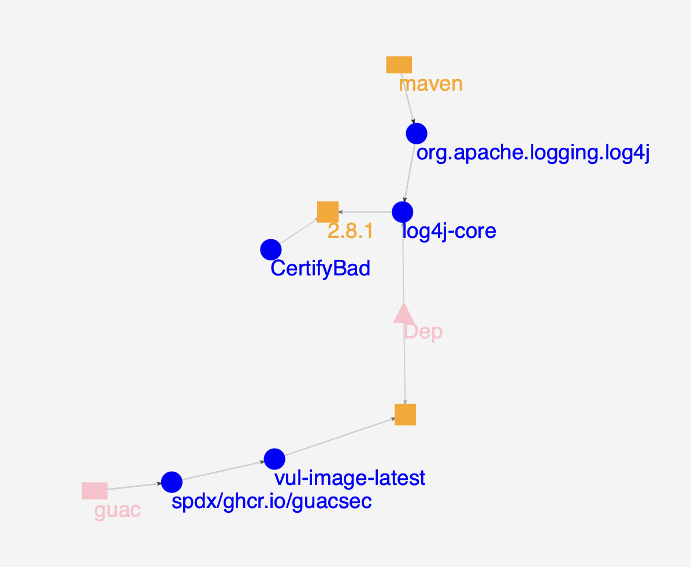
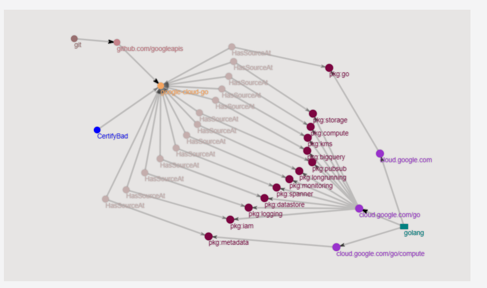

# Reacting to a supply chain incident

A new high-profile vulnerability landed and now you're wondering how you should
react to it.

How do you discover which of your products and software are vulnerable? How
should you go about remediating the problem in your organization? What is the
patch plan?

Using the GraphQL API, you can expose the necessary information to discover how
your organization's software catalog is affected and remediate against
large-scale security incidents.

This demo simulates the discovery of a high-profile vulnerability and shows how
you can discover what software needs to be reviewed or patched. In the future,
`CertifyBad`/`CertifyGood` will be similar to a binary authorization, where
certain checks or policies have determined that an artifact should be utilized
or not.

To find out if you're affected by the security incident and decide what you need
to patch, utilize the [Guac Visualizer]({{ site.baseurl }}). The GUAC visualizer provides a utility to do some basic
analysis and exploration of the software supply chain. This is a great way to
get a sense of the size of the problem and helps when developing prototype
utilities and queries with GUAC (very much like the [vulnerability CLI]({{
site.baseurl }})).

For this demo, we will simulate ingesting an organization's software catalog.
The [demo data]({{ site.baseurl}}) you ingested
into GUAC at the beginning includes a collection of SBOMs and SLSA attestations.

## Requirements

- A fresh copy of the [GUAC service infrastructure through Docker Compose]({{
  site.baseurl }}). Including the `guacone` binary in your
  path and [demo data]({{ site.baseurl}})
  extracted to `guac-data-main`.
- The [GUAC visualizer]({{ site.baseurl }}) up and
  running.

## Mark packages as bad when a security incident occurs

A new security incident has occurred and various communities have pointed out
that a particular package is affected. In this scenario, the debian package
"tzdata" has been found to have a critical vulnerability (yikes!). Now that we
know the package and the vulnerable version, can we use this information to
quickly find where this package is being used?

The first step we can take is to mark this package as bad by using the
`guacone certify` command. This command defaults to assert a negative
certification (instead of a positive one), as well as a `justification` to
indicate why the package is bad. In this case, it is a critical vulnerability:

```bash
guacone certify package "compromised version of tzdata" "pkg:deb/debian/tzdata@2021a-1+deb11u5?arch=all&distro=debian-11"
```

If we successfully added "CertifyBad", the output will show:

```bash
{"level":"info","ts":1683130083.9894989,"caller":"helpers/assembler.go:69","msg":"assembling CertifyBad: 1"}
```

## Explore bad packages

1. To explore all the "certifyBad" items (packages, sources, or artifacts), run
   the "query Bad" CLI:

   ```bash
   guacone query bad
   ```

   This query will automatically search the database and find the list of
   "certifyBad" that are present. For example, an output will look like the
   following:

   ```bash
   Use the arrow keys to navigate: ↓ ↑ → ←
   ? Select CertifyBad to Query:
       pkg:golang/k8s.io/release/images/build/go-runner@%28devel%29 (compromised go-runner)
     ▸ pkg:deb/debian/tzdata@2021a-1+deb11u5 (compromised version of tzdata)
   ```

2. Select a package, source, or artifact from the list to generate a visualizer
   URL containing all the dependent packages and artifacts (packages that use
   the certifyBad items).

   Further iterations of the same CLI tool (or another) could be used to give a
   step-by-step guide to remediation!

   For this scenario, select the
   `pkg:deb/debian/tzdata@2021a-1+deb11u5 (compromised version of tzdata)` that
   we created earlier.

   Doing so will produce a output similar to this:

   ```bash
   ✔ pkg:deb/debian/tzdata@2021a-1+deb11u5 (compromised version of tzdata)
   Visualizer url: http://localhost:3000/?path=149758,45298,1429,1302,1301,132789,132779,132778,36879,15,130436,130360,130359,128282,128275,128274,126197,126188,126187,69882,69866,69865,67322,67245,67244,65156,65149,65148,63070,63064,63063,52259,52166,52165,49728,49595,49594,47402,47396,47395,45322,45287,45286
   ```

3. Navigate to the URL to visualize the output. This will show an expanded graph
   of dependencies.

   

   We can tell from this example (arranging the graph a little) the bad debian
   package (used for timezone information) is commonly used throughout a bunch
   of dependant container images! All are a cause for concern as they are
   notable images for Kubernetes, Redis, Nginx and Python. We need to remediate
   these right away! This allows us to quickly figure out what needs to be
   updated, so that we are not scrambling to first scan and determine where
   `tzdata` might be used.

### Exploring a known bad source repo

In the above example, we looked at a specific package. For this demo, we'll use
a git repo that we know is producing a bunch of bad packages. We want to mark
the repo as compromised, learn which packages are linked to the repo, and figure
out where the packages could be used.

For example, let's take the `googleapis/google-cloud-go` git repo. We will begin
by certifying it as bad:

```bash
guacone certify source "github repo compromised" "git+https://github.com/googleapis/google-cloud-go"
```

You will see an output confirming that it has been added to the database:

```bash
{"level":"info","ts":1683130083.9894989,"caller":"helpers/assembler.go:69","msg":"assembling CertifyBad: 1"}
```

We perform the same actions by running the CLI but this time selecting the new
compromised source repo:

```bash
? Select CertifyBad to Query:
    pkg:golang/github.com/prometheus/client_golang@v1.4.0 (undisclosed vuln)
    pkg:golang/github.com/dougm/pretty (pretty bad undisclosed vuln)
    pkg:golang/github.com/kr/pretty (pretty bad undisclosed vuln)
  ▸ git+https://github.com/googleapis/google-cloud-go (github repo compromised)
↓   pkg:golang/github.com/pmezard/go-difflib (github repo compromised)
```

Selecting the
`gitt+https://github.com/googleapis/google-cloud-go (github repo compromised)`

will output the following (the IDs path could be different):

```bash
✔ git+https://github.com/googleapis/google-cloud-go (github repo compromised)
Visualizer url: http://localhost:3000/?path=136009,849,848,94,136010,135888,4586,136011,135890,136012,135908,136013,4937,136875,4587,136876,136856,136855,139516,4830,139530,4864,139550,4786,139608,4800,140671,140138,140672,140155,149759,135913,135407,5434
```

We can now follow the url to see the following graph:



From this view, we can see that this particular repo is being used by a bunch of
packages, specifically:

| Packages                                        |
| ----------------------------------------------- |
| pkg:golang/cloud.google.com/go                  |
| pkg:golang/cloud.google.com/go/bigquery         |
| pkg:golang/cloud.google.com/go/datastore        |
| pkg:golang/cloud.google.com/go/pubsub           |
| pkg:golang/cloud.google.com/go/storage          |
| pkg:golang/cloud.google.com/go/compute          |
| pkg:golang/cloud.google.com/go/compute/metadata |
| pkg:golang/cloud.google.com/go/iam              |
| pkg:golang/cloud.google.com/go/kms              |
| pkg:golang/cloud.google.com/go/monitoring       |
| pkg:golang/cloud.google.com/go/spanner          |
| pkg:golang/cloud.google.com/go/logging          |
| pkg:golang/cloud.google.com/go/longrunning      |

With this data, we can investigate further and determine which packages are
dependent on these compromised packages and remediate them quickly. The next
step in the demo covers [creating a patch
plan]({{ site.baseurl}})
