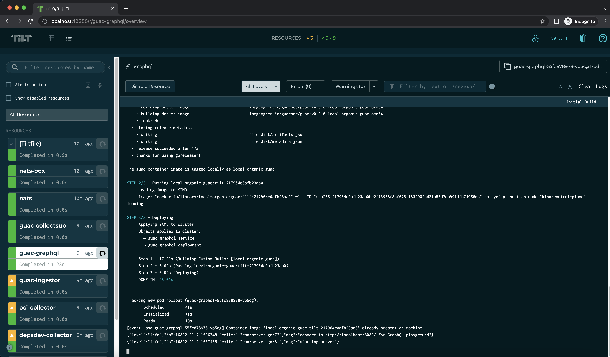

# Set up GUAC with Tilt

[Tilt](https://github.com/tilt-dev/tilt) helps developers build and deploy a Guac stack from source to K8S.
Services are automatically rebuilt and redeploye, staying in sync with the local source tree.
This can  be an effective tool that provides a quick development loop for folks that want to work on top of K8S.

## Getting started

To use Tilt, you'll need an instance of Kubernetes cluster running.
An option is to use [Kind](https://github.com/kubernetes-sigs/kind), that will run Kubernetes in a container, and nest all of the services.

To get started:
```
kind create cluster
tilt up
```

Tilt should look like this:


You can access the GraphQL playground by clicking the 'graphql' link near the top.

### Cleaning up

Tear down with:
```
kind delete cluster
```
